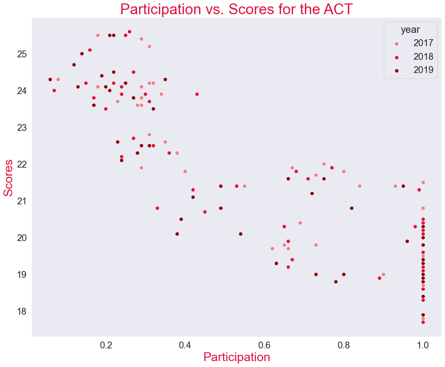
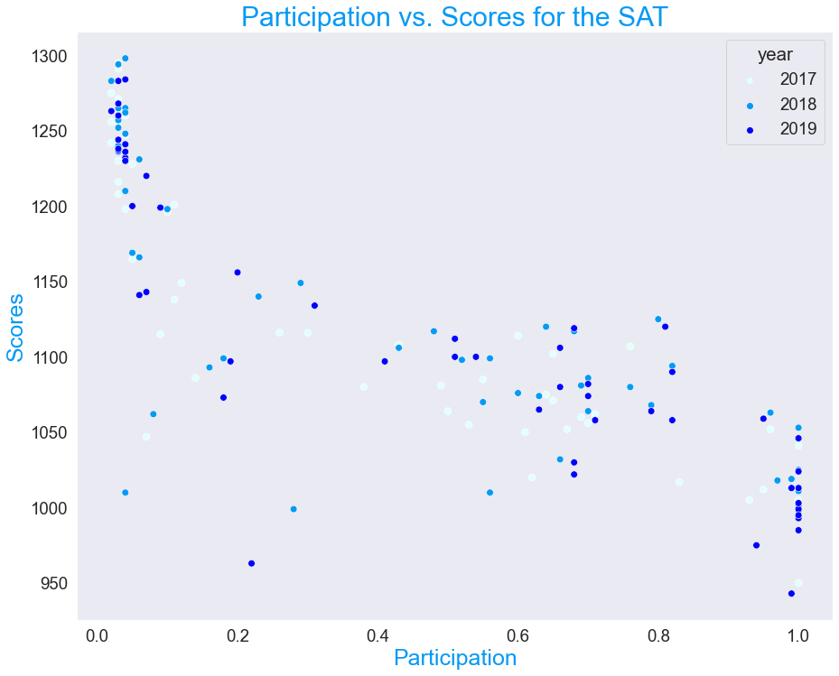

# Project 1: Exploratory Data Analysis & Recommendation

## Problem Statment

- What is the relationship between participation and test scores?
- How can we increase participation for the SAT?

## Contents:
- 2017 Data Import & Cleaning
- 2018 Data Import and Cleaning
- Exploratory Data Analysis
- Data Visualization
- Descriptive and Inferential Statistics
- Outside Research
- Conclusions and Recommendations

## Data Dictionary
|Feature|Type|Dataset|Description|
|---|---|---|---|
|state|*object*|ACT/SAT|A state in the United States of America| 
|year|*int*|ACT/SAT|Year the test was taken| 
|act participation|*float*|ACT|Percentage of high school students who took ACT| 
|act english|*float*|ACT|Composite score for English| 
|act math|*float*|ACT|Composite score for Math| 
|act reading|*float*|ACT|Composite score for Reading| 
|act science|*float*|ACT|Composite score for Science| 
|act composite|*float*|ACT|Composite score for ACT| 
|sat participation|*float*|SAT|Percentage of high school students who took SAT| 
|sat read & write|*int*|SAT|Score for Evidence Based Reading and Writing| 
|sat math|*int*|SAT|Score for Math| 
|sat total|*int*|SAT|Total Score for SAT| 

## Conclusion

Participation rates and scores are negatively correlated: as participation increases, scores increase.

Below are graphs that demonstrate this negative correlation:

States that have SAT School Days also have greater overall participation. 

## Recommendations

1) Convince more states and school districts to have more SAT School Days for greater overall participation. In 2018-2019, Colorado, Connecticut, Delaware, Idaho, Illinois, Maine, Michigan, New Hampshire, Rhode Island, West Virginia, and District of Columbia were all involved in SAT School Day. These all are also the states with the greatest participation rates for the year.

2) Consider each state's academic standards when creating SAT test content, as many states that require the SAT do so because they believe it aligns best with their standards, such as Colorado.

3) Target states where participation is similar between SAT and ACT, such as Texas and Georgia. They are likely to be affected by efforts since there isn't a test that's already required/favored. In addition, these states are already trending towards more participation rates for the SAT each year.

## Sources
https://reports.collegeboard.org/archive/sat-suite-program-results/2019/benefits-sat-school-day
https://www.denverpost.com/2017/03/06/colorado-juniors-sat-college-exam/
https://blog.collegevine.com/here-are-the-average-sat-scores-by-state/
https://blog.prepscholar.com/average-sat-scores-by-state-most-recent
https://blog.prepscholar.com/act-scores-by-state-averages-highs-and-lows
https://www.act.org/content/act/en/research/reports/act-publications/condition-of-college-and-career-readiness-2017.html
